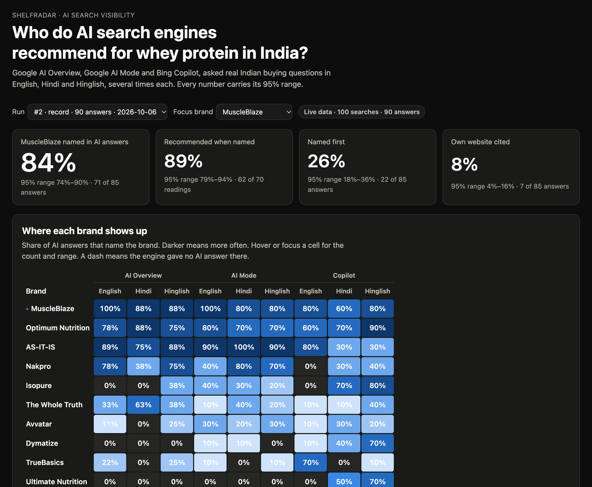
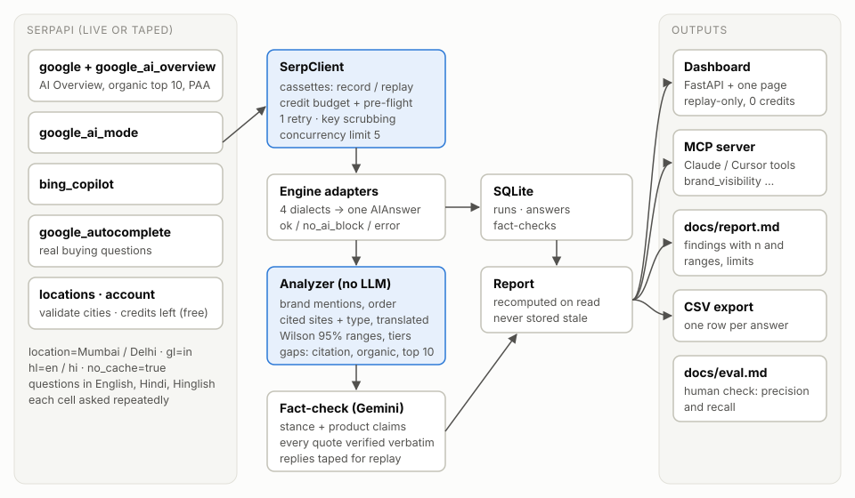
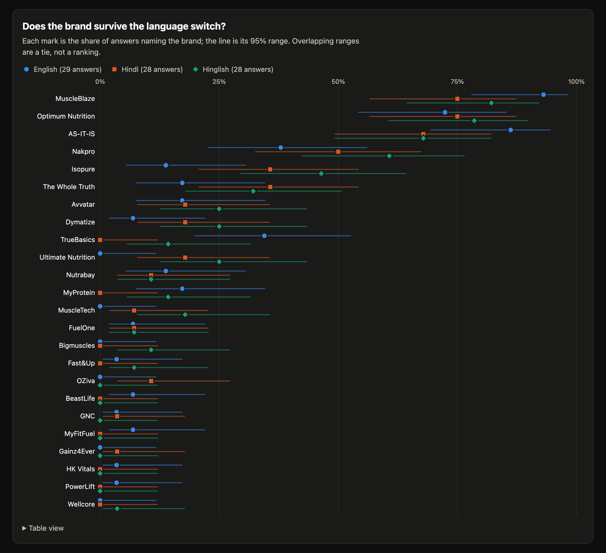

# ShelfRadar

**How often do Google AI Overview, Google AI Mode and Bing Copilot recommend your brand? Measured with SerpApi, with honest error bars, in English, Hindi and Hinglish.**

Shoppers in India now ask *"which is the no. 1 whey protein in India?"* and read an AI answer instead of ten blue links. A brand that is not in that answer is not on the shelf. ShelfRadar asks real buying questions to three AI search engines through SerpApi, again and again, and reports how often each brand is named, named first, recommended and cited, with a 95% range on every number.

The first study covers **whey protein in India**: 5 real buying questions × 3 engines × 3 languages × 2 repeats = 90 AI answers, 27 brands, recorded on 6 Oct 2026.





## Try it in one command (no keys, no searches)

Requires [uv](https://docs.astral.sh/uv/getting-started/installation/).

```bash
git clone https://github.com/soft-rahul/Radar-AI.git shelfradar && cd shelfradar
make demo          # rebuilds the study from the saved responses, then serves the dashboard
```

Open http://localhost:8765. Everything replays from the recorded SerpApi and Gemini responses in `fixtures/`, so the demo needs no API keys and spends nothing.

| Command | What it does | Cost |
|---|---|---|
| `make demo` | Dashboard from the saved study | 0 |
| `make test` | 121 tests, fully offline | 0 |
| `make mcp` | MCP server for Claude / Cursor ([setup](docs/mcp.md)) | 0 |
| `make live-demo` | Ask one question live to all three engines with **your** `SERPAPI_KEY` | ~4 searches |
| `make scan-dry` | Estimate the cost of a new recording | 0 |

## What we found

Full write-up with every number: [docs/report.md](docs/report.md). A difference counts as a finding only when the two 95% ranges do not overlap.

1. **The same question rarely gets the same brand list twice.** In 33 of 40 repeated pairs (same question, engine and language, asked again with no cache) the brands named changed (82%, range 68–91%). One snapshot is not a ranking; visibility is a probability.
2. **Google and Bing disagree about Indian D2C brands.** AS-IT-IS is named in 93% of Google AI Mode answers but 47% on Bing Copilot; Nakpro 63% vs 23%. Copilot leans to imported brands: Isopure 50% vs 12% on AI Overview, Dymatize 40% vs 7% on AI Mode.
3. **Google answers Hindi questions from machine-translated English pages.** For Hindi questions, 25 of 38 AI Overview sources were English websites served through Google Translate. Bing Copilot used none: 97 of its 100 sources had Hindi titles.
4. **Named most is not named first.** MuscleBlaze is named most often (84%, range 74–90%, tied with Optimum Nutrition and AS-IT-IS), but Optimum Nutrition opens the answer about twice as often (43 vs 22 answers).
5. **AI Overview reaches far past page one.** 88% of its 184 sources were not in the top-10 organic results for the same search (Ahrefs reports 62% for the US). Review blogs and shops are cited far more than brands' own websites.



Not significant yet (reported as ties): English vs Hindi vs Hinglish differences for any single brand.

## How SerpApi is used, and why each part matters

| SerpApi | Parameters | What ShelfRadar needs it for | Without it |
|---|---|---|---|
| `google` | `location`, `gl=in`, `hl`, `no_cache` | The AI Overview block **and** the organic top 10 from the same page, so we can measure how far AI sources stray from page one | No AI Overview, no organic comparison |
| `google_ai_overview` | `page_token` | Google often defers the AI Overview (especially in Hindi); the token must be used within a minute | Deferred overviews would be missed and counted wrongly |
| `google_ai_mode` | `location`, `gl`, `hl`, `no_cache` | Google's conversational answer, with its references | No view of Google's newest AI surface |
| `bing_copilot` | `q`, `no_cache` | A second, independent AI engine | Findings 2 and 3 would be invisible |
| `google_autocomplete` + People Also Ask | `gl=in`, `hl` | The questions come from what Indians actually type, including Hinglish | We would be measuring our own guesses |
| Locations API, Account API | free | Validate "Mumbai, Maharashtra, India" (bare "Delhi" also matches Ohio), check credits before spending | Silent wrong locations, budget overruns |

`no_cache=true` plus repeated samples is what turns single answers into measurable probabilities. The whole study used **100 searches**; the client refuses to start any recording whose estimate exceeds the credits left.

## How the numbers are kept honest

- **Repeat, then measure the range.** Each cell is asked repeatedly; every share has a 95% Wilson interval, and brands whose ranges overlap share a tier.
- **"No AI answer" is not "not mentioned".** When an engine shows no AI block, that cell is left out of the denominator.
- **Only the AI's own words count.** Brand names inside cited page titles are ignored. Whole-word matching, Hindi aliases, case-sensitive all-caps names ("AS IT IS" is not "as it is").
- **A human checked the counting.** 30 answers stratified across every engine and language: precision 100% (128/128). A coverage audit then found 9 brands missing from the list (recall 89.5% before the fix); they were added. Details: [docs/eval.md](docs/eval.md).
- **The LLM proposes, code verifies.** Gemini reads only sentences that name a brand and returns stance and product claims; any claim whose quote is not found word for word in the answer is dropped, and so is a per-serving number no serving could have (e.g. a "per 100g" table value read as per serving). Product-fact conflicts are labelled `clear` or `check` (ranges, approximations and pack sizes need a human).
- **Everything is reproducible.** Every SerpApi and Gemini response is saved (keys scrubbed), so anyone can rebuild every number offline.

## Use it from Claude or Cursor (MCP)

`make mcp` starts an MCP server with `list_brands`, `brand_visibility`, `citation_gap` and an opt-in `ask_live`. Ask your assistant *"How visible is Nakpro in AI search, and where is it weakest?"* and get *"49% of 85 answers (39–60%) … Bing Copilot 23%"*. Setup: [docs/mcp.md](docs/mcp.md).

## Run your own study

```bash
cp .env.example .env            # add SERPAPI_KEY (and GEMINI_API_KEY for the fact-check)
make check                      # confirms keys load and .env is ignored by git
uv run python scripts/discover.py study/whey.json      # candidate questions (~4 searches)
uv run python scripts/scan.py --mode record --samples 2 --max 110 --dry-run
uv run python scripts/scan.py --mode record --samples 2 --max 110
uv run python scripts/factcheck.py --run <id> --mode record
make report RUN=<id>
```

Edit `study/whey.json` (brands, aliases, websites, cities) and `study/questions.json` (approved questions) for another category.

## Project layout

```
src/shelfradar/   serp_client · engines · analyzer · factcheck · orchestrator · report · api · mcp_server
web/              dashboard and the accuracy-check page
study/            brands, questions, domain types, human labels, fact sheet template
fixtures/         recorded SerpApi responses (serp/) and Gemini replies (llm/), keys scrubbed
scripts/          probe, discover, scan, factcheck, write_report, eval, demo
docs/             report, eval, MCP setup, architecture, probe notes
tests/            121 offline tests
```

## Limits

A pilot, not a census: one category, five questions, two repeats per cell, one city per language. Bing Copilot is not localised. AI answers change over time; this is a snapshot of 6 Oct 2026. Stance (recommended vs neutral) is an LLM judgement, even though every quote is verified.

## Built with AI tools (disclosure)

- **Claude Code (Claude Opus 5.5)** pair-programmed the code, tests and docs with the author, phase by phase.
- **Gemini** (`gemini-3.5-flash`) is part of the product: it reads brand sentences for stance and product claims at runtime, behind the verbatim-quote check.
- **Demo video:** the screen recording was scripted with Playwright (headless Chrome) and the narration is a computer voice (macOS `say`, voice "Rishi"), not the author's own voice. The words and every number in it come from this repo's report.
- The author chose the problem, approved every phase, checked the 30 answers by hand and reviewed the findings.

## License

MIT. ShelfRadar is an independent project built for the SerpApi India Hackathon 2026 and is not affiliated with SerpApi, Google, Microsoft or any brand named in the study.
